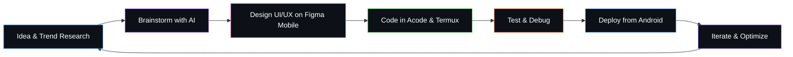

<!--
  =============================================================
  GITHUB PROFILE README — Muhammad Afriza Ardiansyah (afrizas)
  =============================================================
  ONE THING TO REPLACE BEFORE USING:

  1. REPLACE_WITH_YOUR_BANNER_URL -> link to your banner image
     (upload it to this repo under /assets and use the raw
     githubusercontent link, or host it on imgur/postimg)

  All stats widgets already use the username: afrizas

  How to set up:
  Create a new repo with a name EXACTLY matching your GitHub
  username (i.e. "afrizas"), then put this file's content into
  that repo's README.md. GitHub will automatically display it
  on your profile page.
  =============================================================
-->

<div align="center">


</div>

<div align="center">

# Muhammad Afriza Ardiansyah


<br/>


<br/><br/>


</div>

<br/>


I'm **Muhammad Afriza Ardiansyah**, a *vibecoder* who enjoys building things from scratch, from the very first line of code all the way to an interface that actually feels good to look at. To me, programming and design aren't two separate worlds, they're one creative process that constantly feeds into each other.

What makes my journey a bit different: **my entire coding workflow runs 100% on Android**, from writing code and running local servers to pushing to GitHub, all through Termux and mobile apps. To me, hardware limitations aren't a wall, they're fuel for creativity.

I also love keeping up with the latest tech trends heading into 2026, from AI-assisted development and agentic coding workflows to increasingly intelligent design systems. Coding today isn't just about correct syntax anymore, it's about the vibe, how fast an idea can turn into something real.

<table>
<tr>
<td width="50%" valign="top">

**Quick Profile**

| | |
|---|---|
| Location | Indonesia |
| Role | Full-Stack Developer & UI/UX Designer |
| Device | 100% Mobile (Android) |
| Go-To Terminal | Termux |
| Go-To Editor | Acode & Vim (via Termux) |

</td>
<td width="50%" valign="top">

**2026 Focus Radar**

| | |
|---|---|
| Currently Learning | AI-Assisted / Agentic Development |
| Exploring | Mobile-First Development Workflow |
| Exploring | Edge Computing & WebAssembly |
| Exploring | AI-Powered Design Systems |
| Principle | Clean Code, Clean UI |

</td>
</tr>
</table>

<br/>




<br/>


<div align="center">


</div>

<details>
<summary><b>Bonus: Contribution Snake Animation</b></summary>

<br/>

This feature needs a one-time GitHub Actions setup on your profile repo (it runs automatically on GitHub, so no PC required).

1. Create the file `.github/workflows/snake.yml` in the `afrizas/afrizas` repo
2. Paste in the following workflow:

```yaml
name: Generate Snake
on:
  schedule:
    - cron: "0 0 * * *"
  workflow_dispatch:
  push:
    branches: [ main ]

jobs:
  generate:
    runs-on: ubuntu-latest
    steps:
      - uses: Platane/snk@v3
        with:
          github_user_name: ${{ github.repository_owner }}
          outputs: dist/github-contribution-grid-snake.svg
      - uses: crazy-max/ghaction-github-pages@v4
        with:
          target_branch: output
          build_dir: dist
        env:
          GITHUB_TOKEN: ${{ secrets.GITHUB_TOKEN }}
```

3. Once the workflow has run, add this line to your README:

```md

```

</details>

<br/>


<div align="center">


</div>

<br/>


<div align="center">

</div>

<br/>


<div align="center">

</div>

<br/>


<div align="center">

</div>

<br/>


<div align="center">

</div>

<br/>


<div align="center">

</div>

<br/>


<div align="center">


</div>

<br/>


<div align="center">


</div>

<br/>


<div align="center">

</div>

<br/>


<div align="center">

</div>

<br/>


<div align="center">


</div>

<br/>


<div align="center">


</div>

<br/>


<div align="center">


</div>

<br/>


| Trend | Why It's Worth Watching |
|---|---|
| AI-Assisted / Agentic Development | Coding workflows are shifting toward human + AI agent collaboration |
| Mobile-First Development | Building full software from just a smartphone is becoming more viable |
| Edge Computing & WebAssembly | Web app performance is closing the gap with native apps |
| AI-Powered Design Systems | Automated consistency, from components down to color tokens |
| Green Software Engineering | Energy efficiency is becoming a real code quality metric |
| Low-Code meets Pro-Code | Rapid prototyping without giving up technical control |

<br/>

<div align="center">


<br/>


**Thanks for stopping by my profile.**

</div>
